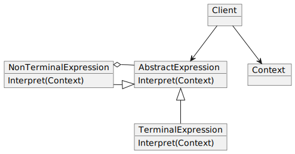

In short, the pattern **defines the grammar of a particular language** in an object-oriented way which can be evaluated by the interpreter itself.

### Problem

A class of problems occurs repeatedly in a well-defined and well-understood domain. If the domain were characterized with a "language", then problems could be easily solved with an interpretation "engine".

### Solution

Define the problem in sentences of language and interpret these sentences to solve the problem.

### Diagram

### Real Analogy about this pattern.

The Interpreter pattern defines a grammatical representation for a language and an interpreter to interpret the grammar. Musicians are examples of Interpreters. The pitch of a sound and its duration can be represented in musical notation on a staff. This notation provides the language of music. Musicians playing the music from the score are able to reproduce the original pitch and duration of each sound represented.

### Implementation

1. Decide if a **"little language"** offers a justificable return on investment.
2. Define a grammar for the language.
3. Map each production in the grammar to a class.
4. Organize the suite of classes into the structure of the Composite pattern.
5. Define an  ``interpret (Context)`` method in the composite hierarchy.
6. The ``Context`` object encapsulates the current state of the input and output as the former is parsed and the latter is accumulated. It is manipulated by each grammer class as the "interpreting" process transforms the input into the output.

### Pros and Cons

|Pros|Cons|
|-----|-----|
|Easy to change and extend the grammar. Existing expressions can be inherited and modified as required.|Complex grammars are difficult to maintain as there will be a lot of terminal classes|
|Implementation is easy as almost all the terminal classes have similar implementations||

##### References.

_Design Patterns and Refactoring_. (n.d.). https://sourcemaking.com/design_patterns/interpreter

Saxena, B. (2020, October 30). _Using Interpreter Design Pattern In Java_. dzone.com. https://dzone.com/articles/using-interpreter-design-pattern-in-java
