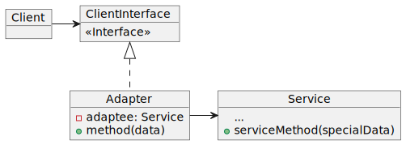

# Adapter

The Adapter is a Structural Pattern that allows the colaboration between objects with incopatibles interfaces.

### Problem

The information is managed by an aplication which is showed in a different way, which the client is requesting.

Imagine that you are creating a market monitoring application. The application download the information of stock exchange from several format sources XML to present it to the user with beautiful designs and diagrams.

At a certain point, you decide to enhance the application by integrating a clever third-party analytics library. But there's a catch: the analytics library only works with data in JSON format.

### Solution

You can create an adapter. This is a special object that converts the interface of an object, so that another object can understand it.

Adapters not only convert data to various formats, but also help objects with different interfaces to collaborate.

It works in the following way:

1. The adapter obtains an interface compatible with one of the existing objects.
2. Using this interface, the existing object can safely invoke the adapter methods.
3. On receiving a call, the adapter passes the request to the second object, but in a format and order that the second object expects.

Sometimes you can even create a two-way adapter that can convert calls in both directions.

### Diagram



### Code

```java
public class RoundHole {
    private double radius;

    public RoundHole(double radius) {
        this.radius = radius;
    }

    public double getRadius() {
        return radius;
    }

    public boolean fits(RoundPeg peg) {
        boolean result;
        result = (this.getRadius() >= peg.getRadius());
        return result;
    }
}
```

```java
public class RoundPeg {
    private double radius;

    public RoundPeg() {}

    public RoundPeg(double radius) {
        this.radius = radius;
    }

    public double getRadius() {
        return radius;
    }
}
```

```java
public class SquarePeg {
    private double width;

    public SquarePeg(double width) {
        this.width = width;
    }

    public double getWidth() {
        return width;
    }

    public double getSquare() {
        double result;
        result = Math.pow(this.width, 2);
        return result;
    }
}
```

##### Here is when the adapter adapter is used...

```java
public class SquarePegAdapter extends RoundPeg {
    private SquarePeg peg;

    public SquarePegAdapter(SquarePeg peg) {
        this.peg = peg;
    }

    @Override
    public double getRadius() {
        double result;
        // Calculate a minimum circle radius, which can fit this peg.
        result = (Math.sqrt(Math.pow((peg.getWidth() / 2), 2) * 2));
        return result;
    }
}
```

```java
public static void main(String[] args) {
        // Round fits round, no surprise.
        RoundHole hole = new RoundHole(5);
        RoundPeg rpeg = new RoundPeg(5);
        if (hole.fits(rpeg)) {
            System.out.println("Round peg r5 fits round hole r5.");
        }

        SquarePeg smallSqPeg = new SquarePeg(2);
        SquarePeg largeSqPeg = new SquarePeg(20);
        // hole.fits(smallSqPeg); // Won't compile.

        // Adapter solves the problem.
        SquarePegAdapter smallSqPegAdapter = new SquarePegAdapter(smallSqPeg);
        SquarePegAdapter largeSqPegAdapter = new SquarePegAdapter(largeSqPeg);
        if (hole.fits(smallSqPegAdapter)) {
            System.out.println("Square peg w2 fits round hole r5.");
        }
        if (!hole.fits(largeSqPegAdapter)) {
            System.out.println("Square peg w20 does not fit into round hole r5.");
        }
    }
```

### Pros and Cons

|Pros|Cons|
|---|---|
|Single responsibility principle. You can separate the interface or data conversion code from the primary business logic of the program.|The overall complexity of the code increases as you must introduce a bunch of new interfaces and classes. Sometimes it is easier to change the service class so that it matches the rest of your code. |
|Open/closed principle. You can introduce new types of adapters to the program without decomposing the existing client code, as long as you work with the adapters through the client interface.||

### Known uses

1. Use the adapter class when you want to use an existing class, but whose interface is not compatible with the rest of the code.
2. It converts the interface of a class to another interface that the client expects. The "Adapter" allows you to use classes together that otherwise could not be used. It implements an old component to a new system. It is accommodated to make unrelated classes work together.

#### References

_Adapter_. (n.d.). https://refactoring.guru/es/design-patterns/adapter