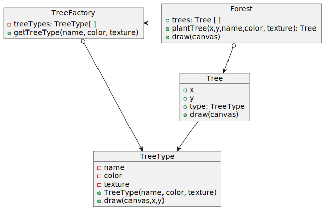

## Problem

The amount of weight stored in the RAM memory due to the large number of objects of the same type, which makes maintaining all these objects a very heavy task.

Our system has one type of component that is repeated numerous times, and the instances have a number of characteristics in common. We want to optimize the size in memory it occupies to get the most out of the system and not waste resources with redundant data.

## Solution

To solve this scenario, we must abstract the characteristics of the element to be replicated into 2 groups: intrinsic and extrinsic. The former refer to the common states of the object or group of objects to be replicated, while the latter refer to the instance's own characteristics.

## Diagram



### Code

**Contains state unique for each tree**
```java
public class Tree {
    private int x;
    private int y;
    private TreeType type;

    public Tree(int x, int y, TreeType type) {
        this.x = x;
        this.y = y;
        this.type = type;
    }

    public void draw(Graphics g) {
        type.draw(g, x, y);
    }
}
```

**Contains state shared by several trees**
```java
public class TreeType {
    private String name;
    private Color color;
    private String otherTreeData;

    public TreeType(String name, Color color, String otherTreeData) {
        this.name = name;
        this.color = color;
        this.otherTreeData = otherTreeData;
    }

    public void draw(Graphics g, int x, int y) {
        g.setColor(Color.BLACK);
        g.fillRect(x - 1, y, 3, 5);
        g.setColor(color);
        g.fillOval(x - 5, y - 10, 10, 10);
    }
}
```

**Encapsulates complexity of flyweight creation**
```java
public class TreeFactory {
    static Map<String, TreeType> treeTypes = new HashMap<>();

    public static TreeType getTreeType(String name, Color color, String otherTreeData) {
        TreeType result = treeTypes.get(name);
        if (result == null) {
            result = new TreeType(name, color, otherTreeData);
            treeTypes.put(name, result);
        }
        return result;
    }
}
```

**Forest, which we draw**
```java
public class Forest extends JFrame {
    private List<Tree> trees = new ArrayList<>();

    public void plantTree(int x, int y, String name, Color color, String otherTreeData) {
        TreeType type = TreeFactory.getTreeType(name, color, otherTreeData);
        Tree tree = new Tree(x, y, type);
        trees.add(tree);
    }

    @Override
    public void paint(Graphics graphics) {
        for (Tree tree : trees) {
            tree.draw(graphics);
        }
    }
}
```

**Output final**
```java
public class Demo {
    static int CANVAS_SIZE = 500;
    static int TREES_TO_DRAW = 1000000;
    static int TREE_TYPES = 2;

    public static void main(String[] args) {
        Forest forest = new Forest();
        for (int i = 0; i < Math.floor(TREES_TO_DRAW / TREE_TYPES); i++) {
            forest.plantTree(random(0, CANVAS_SIZE), random(0, CANVAS_SIZE),
                    "Summer Oak", Color.GREEN, "Oak texture stub");
            forest.plantTree(random(0, CANVAS_SIZE), random(0, CANVAS_SIZE),
                    "Autumn Oak", Color.ORANGE, "Autumn Oak texture stub");
        }
        forest.setSize(CANVAS_SIZE, CANVAS_SIZE);
        forest.setVisible(true);

        System.out.println(TREES_TO_DRAW + " trees drawn");
        System.out.println("---------------------");
        System.out.println("Memory usage:");
        System.out.println("Tree size (8 bytes) * " + TREES_TO_DRAW);
        System.out.println("+ TreeTypes size (~30 bytes) * " + TREE_TYPES + "");
        System.out.println("---------------------");
        System.out.println("Total: " + ((TREES_TO_DRAW * 8 + TREE_TYPES * 30) / 1024 / 1024) +
                "MB (instead of " + ((TREES_TO_DRAW * 38) / 1024 / 1024) + "MB)");
    }

    private static int random(int min, int max) {
        return min + (int) (Math.random() * ((max - min) + 1));
    }
}
```

**Output by console**
```
1000000 trees drawn
---------------------
Memory usage:
Tree size (8 bytes) * 1000000
+ TreeTypes size (~30 bytes) * 2
---------------------
Total: 7MB (instead of 36MB)
```

## Pros and Cons

|Pros|Cons|
|-----|-----|
|Resource savings|The code becomes much more complicated. New team members will always be wondering why the state of an entity was separated in such a way.|
|Reduces the amount of weight on servers|Increases the number of classes in the system.|
|You can save lots of RAM, assuming your program has tons of similar objects.||


#### References

Refactoring.Guru. (2023a, January 1). _Flyweight_. https://refactoring.guru/design-patterns/flyweight

Castellano, E. S. P. L. (n.d.). _Patrones de Diseño (XII): Patrones Estructurales - Flyweight_. Programación En Castellano. https://programacion.net/articulo/patrones_de_diseno_xii_patrones_estructurales_flyweight_1015